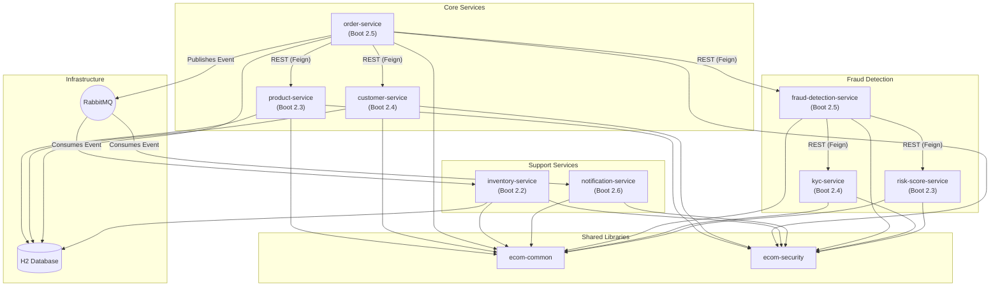
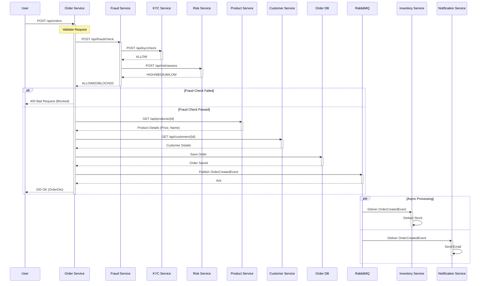

# Moderne Migration Practice Environment

This workspace provides a practice environment for migrating a legacy e-commerce system composed of multiple independent Maven projects to modern Java and Spring Boot.  The components for this practice environment are housed in separate repositories in GitHub, just like they would in a normal distributed organization.

This here provides a centralized set of guides along with the `repos.csv` file used to clone all of these applications and work with them using the Moderne CLI. 

## Environment overview

### Services

| Service | Spring Boot Version | Port | Description |
| :--- | :--- | :--- | :--- |
| **`product-service`** | 2.3.12.RELEASE | 8080 | Manages the product catalog. Exposes REST endpoints. |
| **`customer-service`** | 2.4.13 | 8081 | Manages customer profiles. Exposes REST endpoints. |
| **`order-service`** | 2.5.15 | 8082 | Handles order placement. Orchestrates calls to Product and Customer services and publishes events. |
| **`inventory-service`** | 2.2.13.RELEASE | 8083 | Tracks stock levels. Listens to `OrderCreatedEvent` to deduct inventory. |
| **`notification-service`** | 2.6.15 | 8084 | Sends notifications (email/SMS). Listens to `OrderCreatedEvent`. |
| **`kyc-service`** | 2.4.13 | 8085 | Performs background checks (Mocked: Always Allow). |
| **`risk-score-service`** | 2.3.12.RELEASE | 8086 | Calculates risk score using Drools rules. |
| **`fraud-detection-service`** | 2.5.15 | 8087 | Orchestrates fraud checks by calling KYC and Risk services. |

### Shared Libraries

-   **`ecom-common`**: Contains shared DTOs (e.g., `OrderCreatedEvent`, `ApiResponse`), utilities, and exceptions.
-   **`ecom-security`**: Provides standardized Spring Security configuration and JWT utilities.
-   **`ecom-rest-client`**: Provides a standarded Feign client for making HTTP requests to other services.

### Legacy Dependencies

-   **QueryDSL 3.2.3**: Used for persistence layer type-safe queries in all services. Configured with `apt-maven-plugin`.

### System Architecture

The system follows a microservices architecture with both synchronous (REST) and asynchronous (RabbitMQ) communication.



### Information Flow: Order Creation

When a user places an order, the `order-service` orchestrates the process.



## Setting up the initial state

1. Clone the repositories to an empty directory (we'll refer to this as your workspace from now on):
    ```bash
    mod git sync csv . <moderne-migration-practice-repo>/repos.csv --with-sources
    ```
2. All projects should build out of the box using their predefined older dependencies. In your workspace, you can build all of the projects:
    ```bash
    mod exec . -- mvn clean package
    ```
3. You'll need to have lossless semantic trees (LSTs) built for all of the repositories in order to run recipes:
    ```bash
    mod build .
    ```
4. You can run all of the services locally using Docker with the included docker-compose.yml in this directory:
    ```bash
    WORKSPACE="<PATH TO WORKSPACE>" docker-compose up --build
    ```
    This will start all services along with third-party dependencies such as RabbitMQ, Keycloak, and Jaeger. The services will be available at their respective ports (e.g., `product-service` at 8080, `order-service` at 8082).

## Testing the system

There are Postman collections provided for running some common workflows in the system in the `api-tests` directory.  These can be used to generate some traffic on the services so that you can see them traced using the Jaeger UI at [http://localhost:16686](http://localhost:16686).

## Starting a migration

1. Run a spring boot migration recipe to see if it works out of the box: `mod run . --recipe io.moderne.java.spring.boot4.UpgradeSpringBoot_4_0`
1. Apply the suggested changes to all projects: `mod git apply . --last-recipe-run `
1. Check to see if projects compile after the recipe: `mod exec . -- mvn clean package`
1. All projects fail to compile.  Let's inventory the failures:
    ```
    ------------------------------------
    Environment:
    - MODERNE_JAVA_VERSION=8
    - MODERNE_JAVA_HOME=/Users/matt/.sdkman/candidates/java/8.0.462-librca
    - JAVA_HOME=/Users/matt/.sdkman/candidates/java/8.0.462-librca
    - MODERNE_JAVA_JDK=/Users/matt/.sdkman/candidates/java/8.0.462-librca/bin/java
    - MODERNE_BUILD_TOOL=maven
    - MODERNE_BUILD_TOOL_COMPILE=compile
    - MODERNE_BUILD_TOOL_CHECK=verify
    - MODERNE_BUILD_TOOL_DIR=/Users/matt/workspaces/moderne-migration-workspace/mtthwcmpbll/example-ecom-common
    Command: /bin/zsh -c mvn clean package
    Ran from: /Users/matt/workspaces/moderne-migration-workspace/mtthwcmpbll/example-ecom-common
    ------------------------------------
    ...<snip>...
    [INFO] ------------------------------------------------------------------------
    [INFO] BUILD FAILURE
    [INFO] ------------------------------------------------------------------------
    [INFO] Total time:  2.215 s
    [INFO] Finished at: 2025-12-08T11:53:42-05:00
    [INFO] ------------------------------------------------------------------------
    [ERROR] Failed to execute goal org.apache.maven.plugins:maven-compiler-plugin:3.13.0:compile (default-compile) on project ecom-common: Fatal error compiling: invalid target release: 17 -> [Help 1]
    [ERROR] 
    [ERROR] To see the full stack trace of the errors, re-run Maven with the -e switch.
    [ERROR] Re-run Maven using the -X switch to enable full debug logging.
    [ERROR] 
    [ERROR] For more information about the errors and possible solutions, please read the following articles:
    [ERROR] [Help 1] http://cwiki.apache.org/confluence/display/MAVEN/MojoExecutionException
    ```
    It looks like the Moderne CLI is still discovering Java 8 and it's failing to build.  Building manually with Java JDK 25 works fine, so this is an issue with Moderne's exec command I think. See [this issue](https://github.com/moderneinc/customer-requests/issues/1579) for more info.
    It looks like the ecom-common and ecom-rest-client build successfully, but all others fail.
1. Next, we can try to do our migration in layers to get some iterative value and see where things break down:
    1. TODO: Upgrade build tools
    1. TODO: Upgrade test framework
    1. TODO: Upgrade Java
    1. TODO: Upgrade Spring Boot
1. Let's run some migration planning recipes to see what we can learn:
    ```bash
    # DevCenterStarter
    mod run . --recipe io.moderne.devcenter.DevCenterStarter
    mod devcenter . --last-recipe-run

    # PlanJavaMigration
    mod run . --recipe org.openrewrite.java.migrate.search.PlanJavaMigration
    mod study . --last-recipe-run --data-table JavaVersionMigrationPlan
    ```

    PlanJavaMigration gives us current Java version and if its a Gradle or Maven project.  I'm not sure there's a lot of actionable info here that should change out mind about approach, just situational awareness.

    Let's see if we can find which Spring Boot versions we're using:
    ```bash
    mod run . --recipe org.openrewrite.java.dependencies.DependencyInsight -P "groupIdPattern=org.springframework.boot" -P "artifactIdPattern=spring-boot" -P "scope=runtime"
    ```
1. TODO: Find shared libraries or other kinds of dependencies across repositories
1. TODO: Find projects that are limited in the Java version they can use